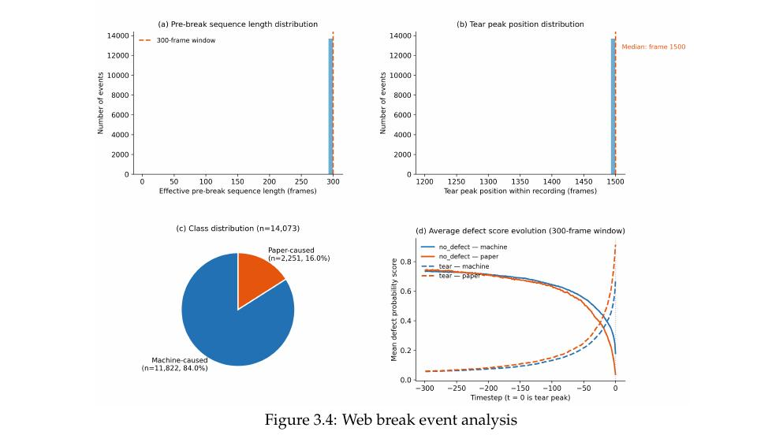
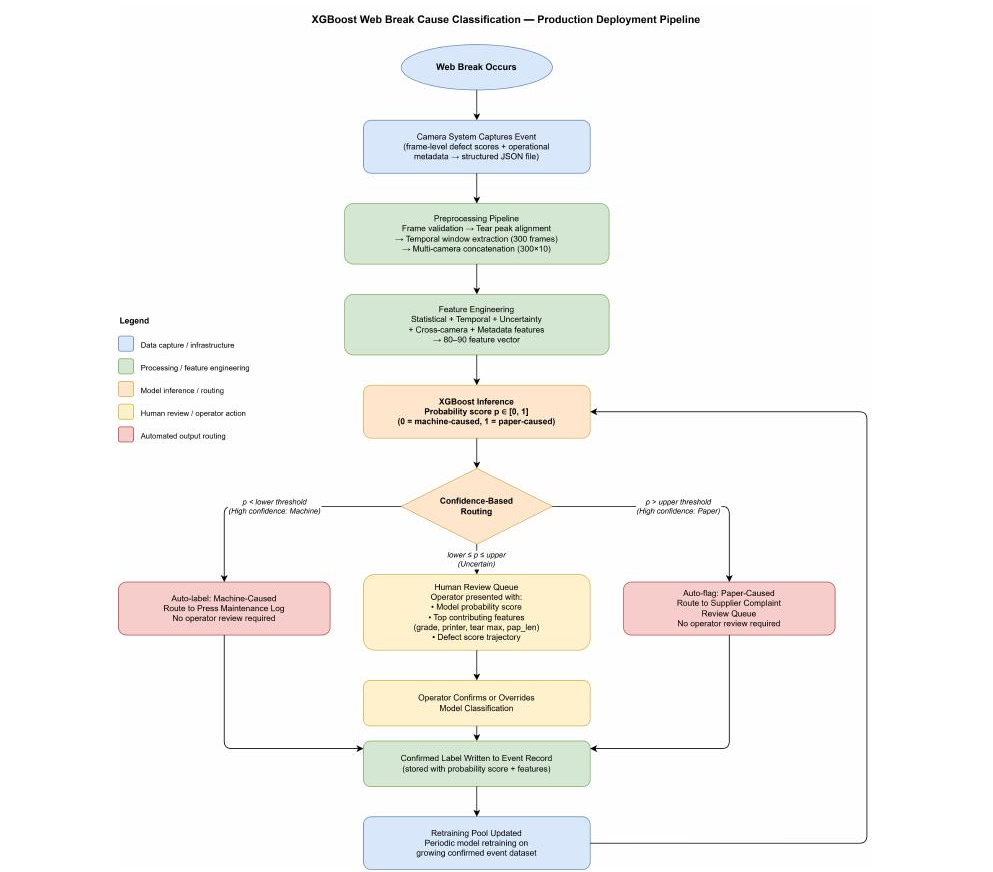

# Multivariate-ts-Classification

[](https://www.python.org/)

Multivariate time-series fault classification with metadata fusion. Built and deployed as a production microservice at **Bertelsmann Marketing Services**, ~0.86 AUC held on live production data.

This repo reproduces the research pipeline (feature engineering, benchmarking, ablation) as runnable, tested code along with proposed deployment architecture.

More figures from the thesis (data structure, model comparison, ablation, GPT-4o results) are in [`images/`](images/).

---

## The problem

Two signal types per event: time-series defect scores (vision system) and static metadata (machine, speed, grade, supplier).



84/16 class imbalance. Machine- and paper-caused breaks show different temporal shapes: machine-caused decays gradually over the full 300-frame sequence, paper-caused stays flat until a sudden collapse near the end.

**Metadata fusion adds +0.070 AUC to XGBoost, +0.028 to TapNet.**

---

## Results

3-fold CV, 14,073 events.

| Model | AUC |
|---|---|
| TST | 0.6742 |
| FCN | 0.6752 |
| ConvTimeNet | 0.6968 ± 0.0131 |
| LSTM-FCN | 0.7013 |
| InceptionTime | 0.7270 |
| TapNet (TS only) | 0.7820 ± 0.0129 |
| XGBoost (TS only) | 0.7895 ± 0.0026 |
| TapNet + metadata | 0.8100 ± 0.0072 |
| **XGBoost + metadata** | **0.8595 ± 0.0009** |

Chart: [`images/fig5_2_model_comparison.png`](images/fig5_2_model_comparison.png)

**Why metadata helps XGBoost more:** XGBoost splits directly on categorical metadata — a tree can isolate "supplier X + high speed" in one split, no extra learning needed. TapNet has no equivalent: metadata is concatenated as extra input, and the network must discover its relevance through gradient descent across the full 300-timestep sequence. That architectural gap is why identical metadata buys XGBoost 2.5x the AUC gain. Chart: [`images/table5_12_metadata_ablation.png`](images/table5_12_metadata_ablation.png).

**Why not just prompt an LLM?** GPT-4o given the exact XGBoost decision rules still collapsed minority recall 46%→18%. Both LLM configs underperform even the CNN baseline. Chart: [`images/fig5_3_gpt4o_results.png`](images/fig5_3_gpt4o_results.png).

Full benchmarking notebook: [`experiments/benchmark.ipynb`](experiments/benchmark.ipynb)

---

## Architecture

```
raw event JSONs (camera CV scores + metadata)
           │
           ▼
┌──────────────────────────────────────────┐
│              preprocessing.py            │
│  • validate frames                       │
│  • align 300-frame window to tear peak   │
│  • extract 68 numeric features           │
│  • parse metadata (unit stripping)       │
└────────────┬─────────────────────────────┘
             │
    ┌────────┴────────┐
    ▼                 ▼
time-series        static metadata
features           (printer, grade,
(per-camera        speed, grammage,
 stats, slopes,    supplier, detector)
 entropy, drift)
    └────────┬────────┘
             ▼
┌──────────────────────────────────────────┐
│                 train.py                 │
│  • StandardScaler (train-only)           │
│  • OneHotEncoder  (train-only)           │
│  • XGBoost + scale_pos_weight            │
│  • threshold tuning on val set           │
│  • artefact saving (model+scaler+OHE+thr)│
└────────────┬─────────────────────────────┘
             ▼
┌──────────────────────────────────────────┐
│              inference.py                │
│  • load artefact                         │
│  • predict: green / yellow / red zones   │
│  • colour-coded Excel output             │
└──────────────────────────────────────────┘
```

Real system also served predictions via FastAPI in production. Not reproduced here for confidentiality purposes.



The confidence-based routing design proposed in the thesis (three-zone red/amber/green classification) was implemented as a production microservice after thesis submission, matching the proposed design.

---

## Key design decisions

**Train-only normalisation** — scaler/OHE fit on train only. Avoids leakage.

**Per-fold threshold tuning** — maximises F1 on the minority class (~8.5% of events). Default 0.5 underperforms badly here.

**Metadata as first-class input** — encoded and fused at the model level, not bolted on.

**Zone-based output:**

| Zone | Probability | Meaning |
|---|---|---|
| 🟢 Keine Reklamation | < 0.30 | 95.8% truly machine fault |
| 🟡 Unsicher | 0.30 – 0.69 | Ambiguous — review needed |
| 🔴 Reklamation | ≥ 0.70 | 62.7%+ truly paper fault |

---

## Data

Ships no data — bring your own event JSONs. Schema: [`data/README.md`](data/README.md).

Originally built on proprietary sensor data at Bertelsmann Marketing Services, Germany.

---

## Quickstart

```bash
git clone https://github.com/vaishnavi28-s/multivariate-timeseries-classification
cd multivariate-ts-classification
pip install -r requirements.txt
```

```bash
python -m src.cli train --data_dir /path/to/labelled/event/zips
python -m src.cli score
python -m src.cli predict --event_json /path/to/event.json
```

**No data? Try the demo:**
```bash
python -m src.cli train --data_dir data
```
Small, easy dataset — proves the pipeline runs. AUC will look artificially high; real numbers are above.

---

## Project structure

```
multivariate-ts-classification/
├── src/
│   ├── preprocessing.py
│   ├── train.py
│   ├── threshold.py
│   ├── inference.py
│   ├── excel_export.py
│   └── cli.py
├── experiments/
│   ├── benchmark.ipynb
│   └── README.md
├── tests/
├── configs/
├── images/
├── data/
│   └── README.md
└── requirements.txt
```

---

## Citation

```bibtex
@misc{sreekumar2026mvts,
  author = {Sreekumar, Vaishnavi},
  title  = {multivariate-ts-classification},
  year   = {2026},
  url    = {https://github.com/vaishnavi28-s/multivariate-timeseries-classification}
}
```

## License

MIT
